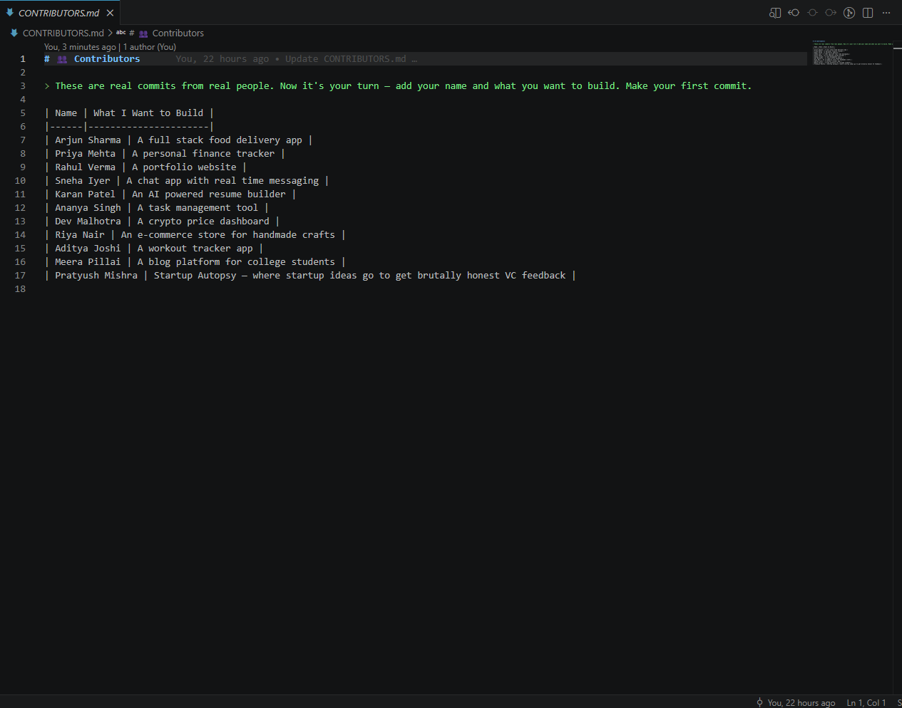
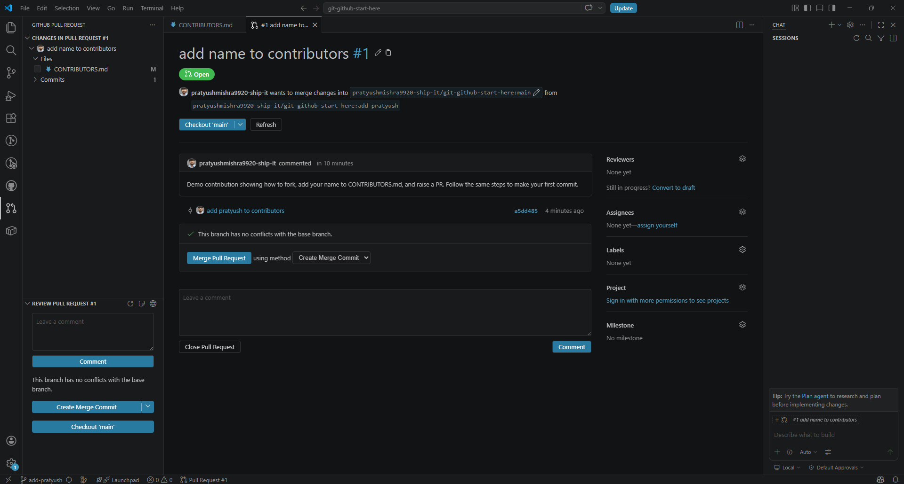
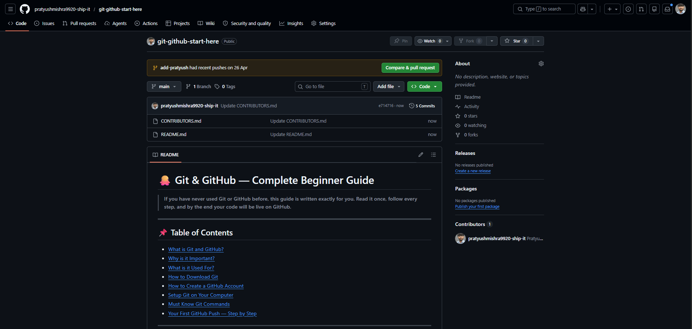

# 🐙 Git & GitHub — Complete Beginner Guide

> **If you have never used Git or GitHub before, this guide is written exactly for you. Read it once, follow every step, and by the end your code will be live on GitHub.**

---

## 📌 Table of Contents

- [What is Git and GitHub?](#what-is-git-and-github)
- [Why is it Important?](#why-is-it-important)
- [What is it Used For?](#what-is-it-used-for)
- [How to Download Git](#how-to-download-git)
- [How to Create a GitHub Account](#how-to-create-a-github-account)
- [Setup Git on Your Computer](#setup-git-on-your-computer)
- [Must Know Git Commands](#must-know-git-commands)
- [Your First GitHub Push — Step by Step](#your-first-github-push--step-by-step)
- [Your First Real Git Task](#your-first-real-git-task)

---

## What is Git and GitHub?

**Git** is a version control system that tracks every change you make in your code over time. It runs locally on your computer.

**GitHub** is a cloud-based platform that hosts your Git repositories online so you can store, share, and collaborate on code from anywhere.

> Think of **Git** as the tool and **GitHub** as the place where your work lives.

---

## Why is it Important?

Without Git, every mistake means losing work. With Git, every change is tracked and you can go back to any previous version anytime.

GitHub takes it further:

- Your code is backed up online
- It is visible to the world
- It acts as your **developer portfolio**

Recruiters and companies look at your GitHub profile. It shows what you have built, how you think, and that you actually ship things.

> ⚠️ **No GitHub profile in 2026 is a red flag.**

---

## What is it Used For?

- Tracking every change you make in your code
- Going back to a previous working version if something breaks
- Collaborating with other developers on the same project
- Contributing to open source projects
- Showcasing your projects to recruiters and the world
- Deploying projects through Vercel, Netlify and other platforms that connect directly to GitHub

---

## How to Download Git

> ⚠️ **Follow each step one by one. Do not skip any step.**

**Step 1** — Go to [https://git-scm.com/downloads](https://git-scm.com/downloads)

**Step 2** — Click on your operating system — Windows, Mac, or Linux

**Step 3** — Download the installer and open it

**Step 4** — Keep clicking **Next** with the default settings. Do not change anything if you are a beginner.

**Step 5** — Click **Install** and wait for it to finish

**Step 6** — Open your terminal or command prompt and run this one command to confirm Git installed correctly:

```bash
git --version
```

✅ If you see something like `git version 2.x.x` — Git is installed successfully.

---

## How to Create a GitHub Account

**Step 1** — Go to [https://github.com](https://github.com)

**Step 2** — Click **Sign Up** in the top right corner

**Step 3** — Enter your email, create a password, and choose a username

> 💡 Keep your username **professional** — recruiters will see it. Avoid random numbers or silly names.

**Step 4** — Verify your email address

**Step 5** — You are done. Your GitHub profile is now live. ✅

---

## Setup Git on Your Computer

After installing Git, you need to tell Git who you are. Open your terminal and run these **one by one** — type one, press Enter, wait, then type the next:

```bash
git config --global user.name "Your Name"
```
> ☝️ Run this first. Press Enter. Wait for it to finish.

```bash
git config --global user.email "your@email.com"
```
> ☝️ Run this second. Press Enter. Wait for it to finish.

✅ Git is now set up with your identity.

---

## Must Know Git Commands

> ⚠️ **Important — Run each command one at a time. Type it, press Enter, wait for it to finish, then move to the next one. Do not copy all commands together.**

---

### Check Git version
```bash
git --version
```

---

### Initialise a new Git repo in your project folder
```bash
git init
```

---

### Check status of your files
```bash
git status
```

---

### Add all files to staging
```bash
git add .
```

---

### Add a specific file only
```bash
git add filename.txt
```

---

### Save your changes with a message
```bash
git commit -m "your message here"
```
> 💡 Write a meaningful message like `"added login page"` not just `"changes"`

---

### Connect your local project to a GitHub repo
```bash
git remote add origin https://github.com/username/repo-name.git
```

---

### Push your code to GitHub
```bash
git push -u origin main
```

---

### Pull latest code from GitHub
```bash
git pull
```

---

### Clone someone else's repo to your computer
```bash
git clone https://github.com/username/repo-name.git
```

---

### Check all commit history
```bash
git log
```

---

### Create a new branch
```bash
git branch branch-name
```

---

### Switch to a branch
```bash
git checkout branch-name
```

---

### Create and switch to a new branch in one command
```bash
git checkout -b branch-name
```

---

### Merge a branch into main
```bash
git merge branch-name
```

---

### See difference in changes
```bash
git diff
```

---

## Your First GitHub Push — Step by Step

> ⚠️ **Read all steps first before you start. Then follow them one by one.**

---

**Step 1** — Go to [https://github.com](https://github.com), click the **+** icon in the top right and select **New Repository**

**Step 2** — Give your repo a name, leave everything else as default, and click **Create Repository**

**Step 3** — Open your terminal inside your project folder and run each of these commands **one by one**. Do not run them all at once:

```bash
git init
```
> ☝️ Run this. Press Enter. Wait.

```bash
git add .
```
> ☝️ Run this. Press Enter. Wait.

```bash
git commit -m "first commit"
```
> ☝️ Run this. Press Enter. Wait.

```bash
git remote add origin https://github.com/yourusername/your-repo.git
```
> ☝️ Replace `yourusername` and `your-repo` with your actual GitHub username and repo name. Run this. Press Enter. Wait.

```bash
git push -u origin main
```
> ☝️ Run this. Press Enter. Wait.

**Step 4** — Go back to your GitHub repo page and refresh it.

✅ **Your code is now live on GitHub.**

---

## 🚀 Your First Real Git Task

Reading about Git is one thing. Actually doing it is another.

Below is the exact flow of a real contribution — done entirely through VS Code, no terminal needed. These are actual screenshots of it being done live. Follow the same steps to make your first real commit on GitHub.

---

### Step 1 — Fork this repo

Go to this repo on GitHub and click the **Fork** button in the top right corner. This creates a copy of this repo under your own GitHub account.

> 💡 Forking means you are creating your own copy of someone else's repo. You make changes in your copy and then raise a Pull Request to get it merged into the original.

---

### Step 2 — Clone your forked repo in VS Code

Go to your forked repo — it will be at `https://github.com/yourusername/git-github-start-here`

Click the green **Code** button and copy the link.

Now open VS Code. Press **Ctrl + Shift + P**, type **Git Clone** and hit Enter. Paste the link you copied.

VS Code will ask you where to save it — pick a folder and open it.

---

### Step 3 — Create a new branch

In VS Code look at the **bottom left corner** — you will see the current branch name `main`. Click on it and a search bar dropdown will open. Select **Create new branch**.

Name it `add-yourname` — example: `add-pratyush`

You will see the branch name in the bottom left change to your new branch name.



---

### Step 4 — Open CONTRIBUTORS.md and add your line

In the left file explorer click on **CONTRIBUTORS.md** to open it.

Add yourself at the bottom of the table in this exact format:

```
| Your Name | your@email.com | What you want to build |
```

Save the file with **Ctrl + S**. You will see it marked **M** (modified) in the Source Control tab on the left.

---

### Step 5 — Stage and commit your change

Click the **Source Control icon** on the left sidebar — it looks like a branch with two nodes.

You will see **CONTRIBUTORS.md** listed there with an **M** next to it.

Click the **+** icon next to the file to stage it.

Then write your commit message in the box at the top — something like:

```
add my name to contributors
```

Click **Commit**.



---

### Step 6 — Push your branch

After committing, VS Code will show a **Publish Branch** or **Sync Changes** button. Click it to push your branch to GitHub.

---

### Step 7 — Raise a Pull Request

Go to your forked repo on GitHub. You will see a banner saying your branch had recent pushes with a **Compare & pull request** button. Click it.

Add a title like `add my name to contributors` and hit **Create Pull Request**.



---

### Step 8 — Wait for it to get merged

Once the PR is merged your name is permanently live in the original repo. That is your first real Git contribution.

> 💡 Want to see how it looks? Go to the repo → click **Branches** at the top → you will see all contributor branches. Click on any branch to see the exact changes they made.

---

> 👥 See who has already done it — [CONTRIBUTORS.md](CONTRIBUTORS.md)

[👉 Add your name now](CONTRIBUTORS.md)

---

> **Your GitHub profile is your resume. Every commit is proof that you build. Start pushing.** 🐙


---

> ⭐ **If this helped you, drop a star on the repo — it helps more beginners find it!**